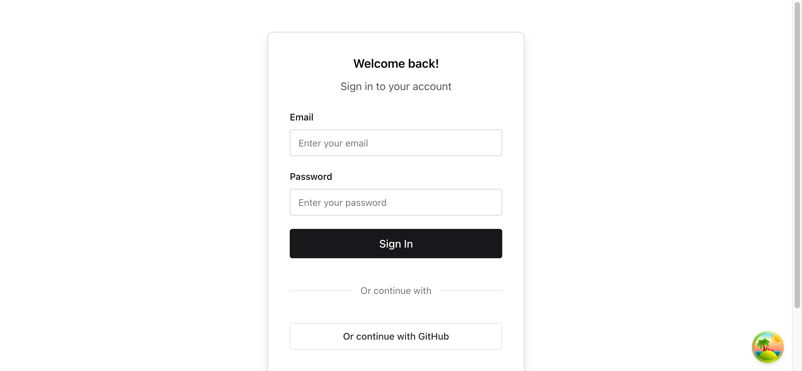
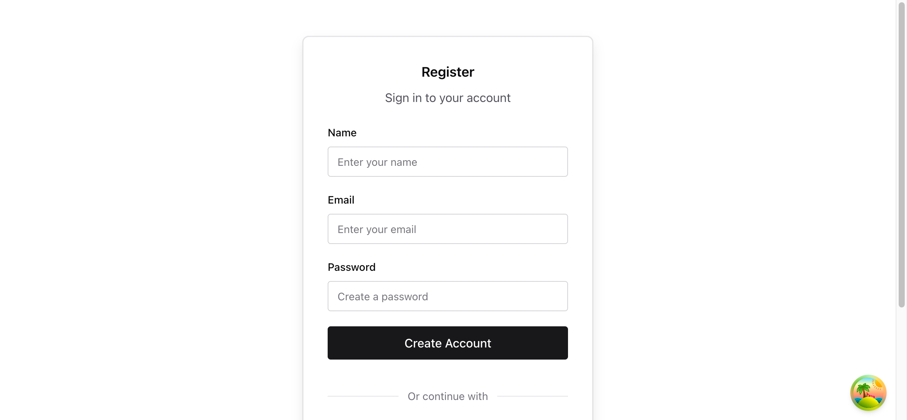
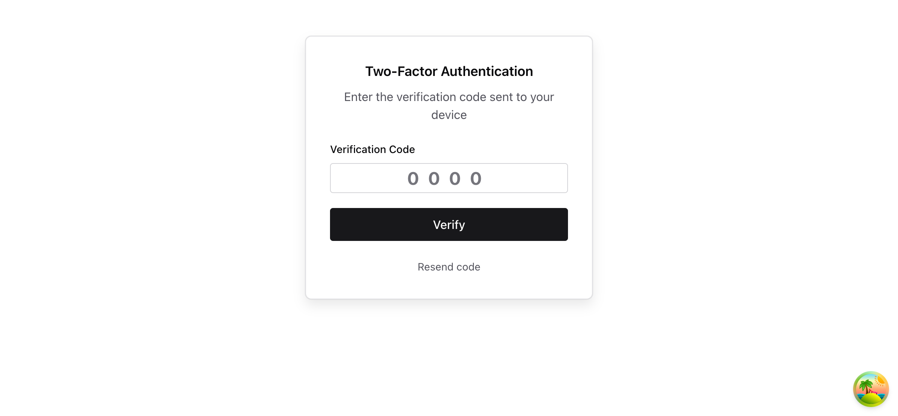
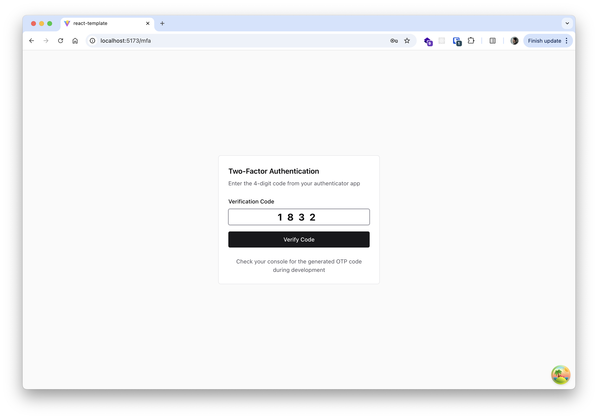

# React Template

A comprehensive React TypeScript template built with Vite and modern development tools.

## Tech stack

- Vite - Next generation frontend tooling
- React 19 - Latest React with TypeScript support
- Chakra UI - Modern component library
- React Router - Declarative routing
- TanStack Query - Powerful data fetching and caching
- React Hook Form - Performant forms with minimal re-renders
- Zod - TypeScript-first schema validation
- Ky - Modern HTTP client based on fetch
- pnpm - Fast, disk space efficient package manager

## Getting Started

### Prerequisites

- Node.js 20.19+ or 22.12+
- pnpm (recommended) or npm

### Installation

```bash
# Install dependencies
pnpm install

# Setup environment variables
cp .env.dist .env
# Edit .env with your actual GitHub OAuth credentials

# Start development server
pnpm run dev

# Build for production
pnpm run build

# Preview production build
pnpm run preview
```

### Environment Setup

1. **Copy the environment template:**

   ```bash
   cp .env.dist .env
   ```

2. **Create a GitHub OAuth App:**
   - Go to [GitHub Developer Settings](https://github.com/settings/applications/new)
   - Create a new OAuth App with these settings:
     - **Authorization callback URL**: `http://localhost:5173/oauth/github/callback`
   - Copy the `Client ID` and `Client Secret`

3. **Update your `.env` file:**

   ```env
   GITHUB_CLIENT_ID=your_actual_github_client_id
   GITHUB_CLIENT_SECRET=your_actual_github_client_secret
   ```

4. **For production deployments:**
   - Update `CLIENT_URL` in `.env` to your domain
   - Update GitHub OAuth app callback URL to `https://yourdomain.com/oauth/github/callback`

## Project Structure

```
src/
├── ui/      # Reusable components
│   ├── button.tsx
│   └── index.ts
├── features/        # Features, usually individual pages
│   ├── login/
│   │   ├── index.tsx        # Template
│   │   └── use-handler.tsx  # View model
│   └── register/
│       ├── index.tsx        # Template
│       └── use-handler.tsx  # View model
├── router.tsx       # React Router configuration
├── system.ts        # Chakra UI theme system
└── main.tsx         # Entry point
```

## Path Aliases

The project is configured with path aliases for cleaner imports:

- `~/` → `src/` directory

Example usage:

```typescript
// Instead of: import { Button } from '../../components/Button'
import { Button } from '~/components';

// Instead of: import { router } from './router'
import { router } from '~/router';
```

## Mock Server

This template includes a mock API server for development purposes:

### Starting the Mock Server

```bash
# Start the mock server (runs on http://localhost:3001)
pnpm run mock-server
```

### Available Endpoints

- `GET /api/todos` - Get todos with pagination
- `POST /api/todos` - Create a new todo
- `PUT /api/todos/:id` - Update a todo
- `DELETE /api/todos/:id` - Delete a todo

The mock server uses an in-memory database and loads initial data from `mock-server/data/todos.json`.

### Frontend Integration

The Vite development server is configured with a proxy that automatically forwards `/api/*` requests to the mock server, eliminating CORS issues:

```typescript
// This request goes to http://localhost:3001/api/todos
const response = await api.get('api/todos');
```

## Development

### Starting Development

1. Start the mock server:

   ```bash
   pnpm run mock-server
   ```

2. Start the frontend development server:

   ```bash
   pnpm run dev
   ```

3. Open http://localhost:5174 (or the port shown in terminal)

or start all

```bash
  pnpm run dev:full
```

## Features

The template includes example implementations of:

- API data fetching with error handling and schema validation
- Form validation with real-time feedback
- Mock API server with TypeScript and Zod validation
- Vite proxy configuration for seamless frontend-backend development

### Implementation Status

- [x] Router, forms, Http client, validation, UI library
- [x] Linting & testing
- [x] Mock server with Express and TypeScript
- [x] Vite proxy configuration
- [x] Auth flow
- [x] Registration
- [ ] Forgot password
- [x] Email login
- [x] OTP
- [x] GitHub login
- [x] LLM instructions
- [ ] Wire UI components with RHF
- [ ] User settings
- [ ] Edit/Create modal
- [ ] Table with sorting and filtering

## Screenshots

<details>
<summary>View Screenshots</summary>









</details>
